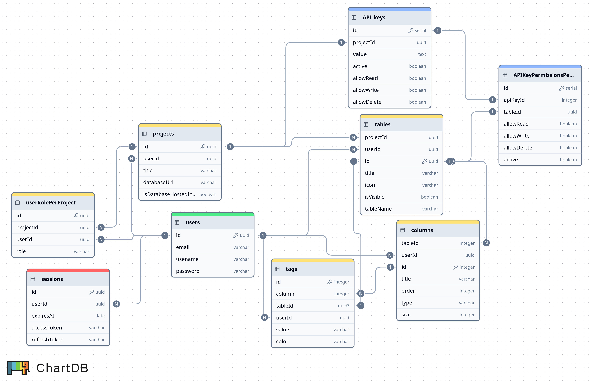

# Dadix backend



## Quick Start

### Prerequisites
- Node.js (v16 or higher)
- PostgreSQL (v12 or higher)
- npm or yarn

### Installation

1. **Clone the repository**
   ```bash
   git clone <repository-url>
   cd backend
   ```

2. **Install dependencies**
   ```bash
   npm install
   ```

3. **Set up environment variables**
   ```bash
   # Copy the example environment file
   cp .env.example .env
   
   # Edit .env with your database credentials
   # See RECORDS_DATABASE_SETUP.md for detailed setup
   ```

4. **Start the server**
   ```bash
   npm start
   ```

The API will be available at `http://localhost:6127`

## Project Structure

```
temp-backend/
├── src/
│   ├── config/          # Database configuration
│   ├── controllers/     # Route controllers
│   ├── middlewares/     # Express middlewares
│   ├── models/          # Sequelize models
│   ├── routes/          # API route definitions
│   ├── services/        # Business services
│   └── utils/           # Utility functions
└── server.js           # Server entry point
```

## API DOCs
## Table of Contents

- [Auth routes](#auth-routes-auth)
- [User routes](#user-routes-user)
- [Project routes](#project-routes-project)
- [Table routes](#table-routes-table)
- [Column routes](#column-routes-column)
- [Tag routes](#tag-routes-tag)
- [Record routes](#record-routes-record)
- [View routes](#view-routes-view)
- [API routes](#api-routes-api)
- [Data Types](#data-types)
- [Roles](#roles)
- [Authentication](#authentication)
- [Error Responses](#error-responses)

> **Note:** This documentation assumes:
> - **Authentication:** All routes requiring authentication use secure HTTP-only cookies (`accessToken`, `refreshToken`)
> - **Headers:** Headers are typically empty `{}` unless otherwise specified (e.g., API routes using Bearer tokens)
> - **Role requirements:** See the [Roles](#roles) section for permission levels

## API Routes

### Auth routes `/auth`

#### `/auth/signup` `POST`

Create a new user account

```js
body: {
  email,
  passcode
}
```

**Responses:**

| code | description | json |
|---|---|---|
| `201` | Success | { user: UserObject } |
| `400` | Invalid request | { message: ErrorMessage } |
| `500` | Server error | { message: ErrorMessage } |

#### `/auth/login` `POST`

Log in a user

```js
body: {
  email,
  passcode
}
```

**Responses:**

| code | description | json |
|---|---|---|
| `200` | Success | { user: UserObject } |
| `400` | Invalid request | { message: ErrorMessage } |
| `500` | Server error | { message: ErrorMessage } |

#### `/auth/logout` `POST`

Log out a user

```js
body: {}
```

**Responses:**

| code | description | json |
|---|---|---|
| `200` | Success | { message: SuccessMessage } |
| `500` | Server error | { message: ErrorMessage } |

---

### User routes `/user`

**(Requires auth)**

#### `/user` `GET`

Get current logged in user

**Responses:**

| code | description | json |
|---|---|---|
| `200` | Success | { user: UserObject } |
| `401` | Unauthorized | { message: ErrorMessage } |
| `500` | Server error | { message: ErrorMessage } |

#### `/user` `PATCH`

Update user info

```js
body: {
  password?: string,
  data: {
    username?: string,
    email?: string
  }
}
```

**Responses:**

| code | description | json |
|---|---|---|
| `200` | Success | { message: "user updated successfully" } |
| `400` | Bad request | { message: ErrorMessage } |
| `401` | Unauthorized | { message: ErrorMessage } |
| `500` | Server error | { message: ErrorMessage } |

#### `/user/delete` `POST`

Delete user account

```js
body: {
  password: string
}
```

**Responses:**

| code | description | json |
|---|---|---|
| `200` | Success | { message: "user deleted successfully" } |
| `400` | Bad request | { message: ErrorMessage } |
| `401` | Unauthorized | { message: ErrorMessage } |
| `500` | Server error | { message: ErrorMessage } |

---

### Project routes `/project`

**(Requires auth)**

#### `/project` `GET`

Get all projects for the authenticated user

**Responses:**

| code | description | json |
|---|---|---|
| `200` | Success | { projects: Array<ProjectObject> } |
| `401` | Unauthorized | { message: ErrorMessage } |
| `500` | Server error | { message: ErrorMessage } |

#### `/project` `POST`

Create a new project

```js
body: {
  title: string,
  icon: string,
  databaseUrl?: string
}
```

**Responses:**

| code | description | json |
|---|---|---|
| `201` | Success | ProjectObject |
| `400` | Invalid request | { message: ErrorMessage } |
| `401` | Unauthorized | { message: ErrorMessage } |

#### `/project/:id` `PATCH`

Update a project

```js
body: {
  data: {
    title?: string,
    icon?: string,
    order?: number
  }
}
```

**Responses:**

| code | description | json |
|---|---|---|
| `200` | Success | ProjectObject |
| `400` | Invalid request | { message: ErrorMessage } |
| `401` | Unauthorized | { message: ErrorMessage } |
| `403` | Forbidden | { message: ErrorMessage } |

#### `/project/:id` `DELETE`

Delete a project

**Responses:**

| code | description | json |
|---|---|---|
| `200` | Success | { message: "Project deleted successfully" } |
| `400` | Invalid request | { message: ErrorMessage } |
| `401` | Unauthorized | { message: ErrorMessage } |
| `403` | Forbidden | { message: ErrorMessage } |

#### `/project/:id/members` `GET`

List project members

**Responses:**

| code | description | json |
|---|---|---|
| `200` | Success | { members: Array<MemberObject> } |
| `400` | Invalid request | { message: ErrorMessage } |
| `401` | Unauthorized | { message: ErrorMessage } |

#### `/project/:id/roles` `POST`

Assign a role to a user

```js
body: {
  targetUserId: string,
  role: "Owner" | "Admin" | "Editor" | "Viewer"
}
```

**Responses:**

| code | description | json |
|---|---|---|
| `200` | Success | { role: RoleObject } |
| `400` | Invalid request | { message: ErrorMessage } |
| `401` | Unauthorized | { message: ErrorMessage } |
| `403` | Forbidden | { message: ErrorMessage } |

#### `/project/:id/roles` `DELETE`

Remove a user's role from project

```js
query: {
  targetUserId: string
}
```

**Responses:**

| code | description | json |
|---|---|---|
| `200` | Success | { message: "Role removed" } |
| `400` | Invalid request | { message: ErrorMessage } |
| `401` | Unauthorized | { message: ErrorMessage } |
| `403` | Forbidden | { message: ErrorMessage } |

#### `/project/:id/invites` `GET`

List project invites

**Responses:**

| code | description | json |
|---|---|---|
| `200` | Success | { invites: Array<InviteObject> } |
| `400` | Invalid request | { message: ErrorMessage } |
| `401` | Unauthorized | { message: ErrorMessage } |

#### `/project/:id/invites` `POST`

Create a project invite

```js
body: {
  role: "Admin" | "Editor" | "Viewer",
  email?: string,
  expiresAt?: string
}
```

**Responses:**

| code | description | json |
|---|---|---|
| `201` | Success | { invite: InviteObject } |
| `400` | Invalid request | { message: ErrorMessage } |
| `401` | Unauthorized | { message: ErrorMessage } |

#### `/project/:id/invites/:inviteId` `DELETE`

Revoke a project invite

**Responses:**

| code | description | json |
|---|---|---|
| `200` | Success | { message: "Invite revoked" } |
| `400` | Invalid request | { message: ErrorMessage } |
| `401` | Unauthorized | { message: ErrorMessage } |

#### `/project/invite/:token` `GET`

Get invite details by token

**Responses:**

| code | description | json |
|---|---|---|
| `200` | Success | { invite: InviteObject } |
| `400` | Invalid request | { message: ErrorMessage } |
| `404` | Invite not found | { message: ErrorMessage } |

#### `/project/invite/:token/accept` `POST`

Accept a project invite

**Responses:**

| code | description | json |
|---|---|---|
| `200` | Success | { message: "Invite accepted" } |
| `400` | Invalid request | { message: ErrorMessage } |
| `401` | Unauthorized | { message: ErrorMessage } |
| `403` | Forbidden | { message: ErrorMessage } |
| `404` | Invite not found | { message: ErrorMessage } |

---

### Table routes `/table`

**(Requires auth)**

#### `/table` `GET`

Get all tables for a project

```js
query: {
  projectId: string
}
```

**Responses:**

| code | description | json |
|---|---|---|
| `200` | Success | Array of TableObjects |
| `400` | Invalid request | { message: ErrorMessage } |
| `401` | Unauthorized | { message: ErrorMessage } |
| `500` | Server error | { message: ErrorMessage } |

#### `/table` `POST`

Create a new table

```js
body: {
  name: string,
  icon?: string,
  projectId: string
}
```

**Responses:**

| code | description | json |
|---|---|---|
| `201` | Success | TableObject |
| `400` | Invalid request | { message: ErrorMessage } |
| `401` | Unauthorized | { message: ErrorMessage } |
| `500` | Server error | { message: ErrorMessage } |

#### `/table/:id` `GET`

Get a specific table by ID

```js
query: {
  projectId: string
}
```

**Responses:**

| code | description | json |
|---|---|---|
| `200` | Success | TableObject with fields |
| `400` | Invalid request | { message: ErrorMessage } |
| `401` | Unauthorized | { message: ErrorMessage } |
| `404` | Table not found | { message: ErrorMessage } |
| `500` | Server error | { message: ErrorMessage } |

#### `/table/:id` `PATCH`

Update a table

```js
query: {
  projectId: string
}
body: {
  data: {
    name?: string,
    icon?: string
  }
}
```

**Responses:**

| code | description | json |
|---|---|---|
| `200` | Success | Updated TableObject |
| `400` | Invalid request | { message: ErrorMessage } |
| `401` | Unauthorized | { message: ErrorMessage } |
| `403` | Forbidden | { message: ErrorMessage } |
| `404` | Table not found | { message: ErrorMessage } |
| `500` | Server error | { message: ErrorMessage } |

#### `/table/:id` `DELETE`

Delete a table

```js
query: {
  projectId: string
}
```

**Responses:**

| code | description | json |
|---|---|---|
| `200` | Success | { message: "Table deleted successfully!" } |
| `400` | Invalid request | { message: ErrorMessage } |
| `401` | Unauthorized | { message: ErrorMessage } |
| `403` | Forbidden | { message: ErrorMessage } |
| `404` | Table not found | { message: ErrorMessage } |
| `500` | Server error | { message: ErrorMessage } |

#### `/table/import` `POST`

Import a table from CSV file

```js
body: {
  projectId?: string,
  file: File // CSV file
}
```

**Responses:**

| code | description | json |
|---|---|---|
| `201` | Success | { message: "Table created successfuly", tableId: string } |
| `400` | Invalid request | { message: ErrorMessage } |
| `401` | Unauthorized | { message: ErrorMessage } |
| `500` | Server error | { message: ErrorMessage } |

---

### Column routes `/column`

**(Requires auth)**

#### `/column` `POST`

Create a new column

```js
body: {
  name: string,
  type: "UUID" | "SERIAL" | "STRING" | "TEXT" | "INTEGER" | "REAL" | "BOOLEAN" | "DATE" | "CHOICE" | "RELATION" | "FORMULA",
  tableId: string,
  options?: Array
}
```

**Responses:**

| code | description | json |
|---|---|---|
| `201` | Success | ColumnObject |
| `400` | Invalid request | { message: ErrorMessage } |
| `401` | Unauthorized | { message: ErrorMessage } |
| `403` | Forbidden | { message: ErrorMessage } |
| `500` | Server error | { message: ErrorMessage } |

#### `/column/:id` `PATCH`

Update a column

```js
body: {
  tableId: string,
  data: {
    name?: string,
    type?: string,
    isVisible?: boolean,
    isNullable?: boolean,
    isUnique?: boolean,
    size?: number,
    options?: Array
  }
}
```

**Responses:**

| code | description | json |
|---|---|---|
| `200` | Success | ColumnObject |
| `400` | Invalid request | { message: ErrorMessage } |
| `401` | Unauthorized | { message: ErrorMessage } |
| `403` | Forbidden | { message: ErrorMessage } |
| `500` | Server error | { message: ErrorMessage } |

#### `/column/:id` `DELETE`

Delete a column

```js
query: {
  tableId: string
}
```

**Responses:**

| code | description | json |
|---|---|---|
| `200` | Success | { message: "Column deleted successfully" } |
| `400` | Invalid request | { message: ErrorMessage } |
| `401` | Unauthorized | { message: ErrorMessage } |
| `403` | Forbidden | { message: ErrorMessage } |
| `500` | Server error | { message: ErrorMessage } |

#### `/column/formula` `PATCH`

Update column formula

```js
body: {
  tableId: string,
  columnId: string,
  value: string
}
```

**Responses:**

| code | description | json |
|---|---|---|
| `200` | Success | ColumnObject |
| `400` | Invalid request | { message: ErrorMessage } |
| `401` | Unauthorized | { message: ErrorMessage } |
| `403` | Forbidden | { message: ErrorMessage } |
| `500` | Server error | { message: ErrorMessage } |

#### `/column/text-options` `PATCH`

Update column text options

```js
body: {
  tableId: string,
  columnId: string,
  data: object
}
```

**Responses:**

| code | description | json |
|---|---|---|
| `200` | Success | ColumnObject |
| `400` | Invalid request | { message: ErrorMessage } |
| `401` | Unauthorized | { message: ErrorMessage } |
| `403` | Forbidden | { message: ErrorMessage } |
| `500` | Server error | { message: ErrorMessage } |

#### `/column/relation-options` `PATCH`

Update column relation options

```js
body: {
  tableId: string,
  columnId: string,
  data: object
}
```

**Responses:**

| code | description | json |
|---|---|---|
| `200` | Success | ColumnObject |
| `400` | Invalid request | { message: ErrorMessage } |
| `401` | Unauthorized | { message: ErrorMessage } |
| `403` | Forbidden | { message: ErrorMessage } |
| `500` | Server error | { message: ErrorMessage } |

#### `/column/relation-options/:id/relation-table-view-column` `GET`

Get relation table view columns

```js
query: {
  tableId: string
}
```

**Responses:**

| code | description | json |
|---|---|---|
| `200` | Success | Array of ColumnObjects |
| `400` | Invalid request | { message: ErrorMessage } |
| `401` | Unauthorized | { message: ErrorMessage } |

#### `/column/relation-options/relation-table-view-column/:id` `PATCH`

Update relation table view column

```js
body: {
  relationId: string,
  tableId: string,
  tableColumnId: string,
  data: object
}
```

**Responses:**

| code | description | json |
|---|---|---|
| `200` | Success | ColumnObject |
| `400` | Invalid request | { message: ErrorMessage } |
| `401` | Unauthorized | { message: ErrorMessage } |
| `500` | Server error | { message: ErrorMessage } |

---

### Tag routes `/tag`

**(Requires auth)**

#### `/tag` `POST`

Create a new tag

```js
body: {
  value: string,
  color?: string,
  tableId: string,
  columnId: string
}
```

**Responses:**

| code | description | json |
|---|---|---|
| `201` | Success | { id, value, color, order } |
| `400` | Invalid request | { message: ErrorMessage } |
| `401` | Unauthorized | { message: ErrorMessage } |
| `500` | Server error | { message: ErrorMessage } |

#### `/tag/:id` `PATCH`

Update a tag

```js
body: {
  tableId: string,
  columnId: string,
  data: {
    value?: string,
    color?: string
  }
}
```

**Responses:**

| code | description | json |
|---|---|---|
| `200` | Success | TagObject |
| `400` | Invalid request | { message: ErrorMessage } |
| `401` | Unauthorized | { message: ErrorMessage } |
| `500` | Server error | { message: ErrorMessage } |

#### `/tag/:id` `DELETE`

Delete a tag

```js
query: {
  tableId: string,
  columnId: string
}
```

**Responses:**

| code | description | json |
|---|---|---|
| `200` | Success | { message: "Tag deleted successfuly!" } |
| `400` | Invalid request | { message: ErrorMessage } |
| `401` | Unauthorized | { message: ErrorMessage } |
| `500` | Server error | { message: ErrorMessage } |

---

### Record routes `/record`

**(Requires auth)**

#### `/record` `GET`

Get all records for a table

```js
query: {
  tableId: string,
  filter?: string,
  limit?: number,
  offset?: number,
  order?: string
}
```

**Filter Syntax:**

The `filter` parameter uses a SQL-like syntax with the following operators:

| Operator | Description | Example |
|----------|-------------|---------|
| `eq` | Equals | `eq(name, "John")` |
| `neq` | Not equals | `neq(status, "active")` |
| `lt` | Less than | `lt(age, 18)` |
| `lte` | Less than or equal | `lte(quantity, 10)` |
| `gt` | Greater than | `gt(price, 100)` |
| `gte` | Greater than or equal | `gte(rating, 4.5)` |
| `like` | Contains (case-insensitive) | `like(email, "@gmail.com")` |
| `nlike` | Not contains | `nlike(title, "test")` |
| `isnull` | Is null | `isnull(description)` |
| `notnull` | Is not null | `notnull(phone)` |
| `in` | In list | `in(status, "active", "pending")` |
| `notin` | Not in list | `notin(role, "admin", "owner")` |
| `and` | And | `and(eq(a, 1), gt(b, 2))` |
| `or` | Or | `or(eq(x, 1), eq(y, 2))` |
| `not` | Not | `not(eq(status, "deleted"))` |

**Notes:**
- String values must use quotes: `"value"` or `'value'`
- Multiple conditions can be combined using `and()`, `or()`, `not()`

**Filter Examples:**

| Filter | SQL Equivalent |
|--------|---------------|
| `eq(id, 1)` | WHERE id = 1 |
| `like(name, "John")` | WHERE name ILIKE '%John%' |
| `gt(age, 18)` | WHERE age > 18 |
| `in(status, "active", "pending")` | WHERE status IN ('active', 'pending') |
| `and(eq(status, "active"), gt(age, 18))` | WHERE status = 'active' AND age > 18 |
| `or(eq(id, 1), eq(id, 2))` | WHERE id = 1 OR id = 2 |

**Responses:**

| code | description | json |
|---|---|---|
| `200` | Success | Array of RecordObjects |
| `400` | Invalid request | { message: ErrorMessage } |
| `401` | Unauthorized | { message: ErrorMessage } |
| `500` | Server error | { message: ErrorMessage } |

#### `/record/all` `GET`

Get all records for a table (streaming)

```js
query: {
  tableId: string
}
```

**Responses:**

| code | description | json |
|---|---|---|
| `200` | Success | Stream of RecordObjects |
| `400` | Invalid request | { message: ErrorMessage } |
| `401` | Unauthorized | { message: ErrorMessage } |
| `500` | Server error | { message: ErrorMessage } |

#### `/record` `POST`

Create a new record

```js
body: {
  tableId: string,
  data: {
    [fieldName]: value
  }
}
```

**Responses:**

| code | description | json |
|---|---|---|
| `201` | Success | RecordObject |
| `400` | Invalid request | { message: ErrorMessage } |
| `401` | Unauthorized | { message: ErrorMessage } |
| `500` | Server error | { message: ErrorMessage } |

#### `/record` `DELETE`

Delete multiple records

```js
query: {
  tableId: string,
  ids: string // comma-separated IDs
}
```

**Responses:**

| code | description | json |
|---|---|---|
| `200` | Success | { message: "record deleted successfuly!" } |
| `400` | Invalid request | { message: ErrorMessage } |
| `401` | Unauthorized | { message: ErrorMessage } |
| `500` | Server error | { message: ErrorMessage } |

#### `/record/:id` `GET`

Get a single record

```js
body: {
  tableId: string
}
```

**Responses:**

| code | description | json |
|---|---|---|
| `200` | Success | RecordObject |
| `400` | Invalid request | { message: ErrorMessage } |
| `401` | Unauthorized | { message: ErrorMessage } |
| `404` | Not found | { message: ErrorMessage } |
| `500` | Server error | { message: ErrorMessage } |

#### `/record/:id` `PATCH`

Update a record

```js
body: {
  tableId: string,
  data: {
    [fieldName]: value
  }
}
```

**Responses:**

| code | description | json |
|---|---|---|
| `200` | Success | RecordObject |
| `400` | Invalid request | { message: ErrorMessage } |
| `401` | Unauthorized | { message: ErrorMessage } |
| `404` | Not found | { message: ErrorMessage } |
| `500` | Server error | { message: ErrorMessage } |

#### `/record/:id` `DELETE`

Delete a record

```js
query: {
  tableId: string
}
```

**Responses:**

| code | description | json |
|---|---|---|
| `200` | Success | { message: "record deleted successfuly!" } |
| `400` | Invalid request | { message: ErrorMessage } |
| `401` | Unauthorized | { message: ErrorMessage } |
| `404` | Not found | { message: ErrorMessage } |
| `500` | Server error | { message: ErrorMessage } |

#### `/record/:id/related` `GET`

Get related records

```js
query: {
  tableId: string,
  relatedToTableWithId: string,
  relationId: string,
  limit?: number,
  offset?: number,
  order?: string
}
```

**Responses:**

| code | description | json |
|---|---|---|
| `200` | Success | Array of RecordObjects |
| `400` | Invalid request | { message: ErrorMessage } |
| `401` | Unauthorized | { message: ErrorMessage } |
| `404` | Not found | { message: ErrorMessage } |
| `500` | Server error | { message: ErrorMessage } |

#### `/record/:id/related` `POST`

Create a related record

```js
body: {
  tableId: string,
  relatedToTableWithId: string,
  relationId: string,
  relateToRecordWithId: string
}
```

**Responses:**

| code | description | json |
|---|---|---|
| `201` | Success | RecordObject |
| `400` | Invalid request | { message: ErrorMessage } |
| `401` | Unauthorized | { message: ErrorMessage } |
| `404` | Not found | { message: ErrorMessage } |
| `500` | Server error | { message: ErrorMessage } |

#### `/record/:id/related` `DELETE`

Delete a related record

```js
query: {
  tableId: string,
  relatedToRecordWithId: string,
  relationId: string,
  relationRecordId: string
}
```

**Responses:**

| code | description | json |
|---|---|---|
| `200` | Success | { message: "record deleted" } |
| `400` | Invalid request | { message: ErrorMessage } |
| `401` | Unauthorized | { message: ErrorMessage } |
| `500` | Server error | { message: ErrorMessage } |

---

### View routes `/view`

**(Requires auth)**

#### `/view` `GET`

Get all views for a table

```js
query: {
  tableId: string
}
```

**Responses:**

| code | description | json |
|---|---|---|
| `200` | Success | { views: Array<ViewObject> } |
| `400` | Invalid request | { message: ErrorMessage } |
| `401` | Unauthorized | { message: ErrorMessage } |
| `500` | Server error | { message: ErrorMessage } |

#### `/view` `POST`

Create a new view

```js
body: {
  tableId: string,
  name: string,
  icon: string,
  type: "gridView" | "formView" | "kanbanView" | "pivotTableView" | "chartView" | "calendarView" | "timelineView" | "mapView" | "dashboardView"
}
```

**Responses:**

| code | description | json |
|---|---|---|
| `201` | Success | { view: ViewObject } |
| `400` | Invalid request | { message: ErrorMessage } |
| `401` | Unauthorized | { message: ErrorMessage } |
| `500` | Server error | { message: ErrorMessage } |

#### `/view/:id` `GET`

Get a specific view

```js
query: {
  tableId: string
}
```

**Responses:**

| code | description | json |
|---|---|---|
| `200` | Success | ViewObject |
| `400` | Invalid request | { message: ErrorMessage } |
| `401` | Unauthorized | { message: ErrorMessage } |
| `404` | View not found | { message: ErrorMessage } |
| `500` | Server error | { message: ErrorMessage } |

#### `/view/:id` `PATCH`

Update a view

```js
query: {
  tableId: string
}
body: {
  data: {
    name?: string,
    icon?: string,
    order?: number
  }
}
```

**Responses:**

| code | description | json |
|---|---|---|
| `200` | Success | { view: ViewObject } |
| `400` | Invalid request | { message: ErrorMessage } |
| `401` | Unauthorized | { message: ErrorMessage } |
| `500` | Server error | { message: ErrorMessage } |

#### `/view/:id` `DELETE`

Delete a view

```js
query: {
  tableId: string
}
```

**Responses:**

| code | description | json |
|---|---|---|
| `200` | Success | { message: "View deleted successfully" } |
| `400` | Invalid request | { message: ErrorMessage } |
| `401` | Unauthorized | { message: ErrorMessage } |
| `500` | Server error | { message: ErrorMessage } |

#### `/view/:id/duplicate` `POST`

Duplicate a view

```js
body: {
  tableId: string
}
```

**Responses:**

| code | description | json |
|---|---|---|
| `201` | Success | { view: ViewObject } |
| `400` | Invalid request | { message: ErrorMessage } |
| `401` | Unauthorized | { message: ErrorMessage } |
| `500` | Server error | { message: ErrorMessage } |

#### `/view/grid/:id` `PATCH`

Update grid view column

```js
body: {
  gridViewId: string,
  tableId: string,
  tableColumnId: string,
  data: object
}
```

**Responses:**

| code | description | json |
|---|---|---|
| `200` | Success | GridViewColumnObject |
| `400` | Invalid request | { message: ErrorMessage } |
| `401` | Unauthorized | { message: ErrorMessage } |
| `500` | Server error | { message: ErrorMessage } |

---

### API routes `/api`

#### `/api/key` `GET`

Get or create project API key

```js
query: {
  projectId: string
}
```

**Responses:**

| code | description | json |
|---|---|---|
| `200` | Success | { APIKey: string } |
| `400` | Invalid request | { message: ErrorMessage } |
| `401` | Unauthorized | { message: ErrorMessage } |
| `404` | Not found | { message: ErrorMessage } |

#### `/api/v1/tables/:tableId/records` `GET`

Get table records via API (requires Bearer token)

```js
headers: {
  Authorization: "Bearer <api_key>"
}
query: {
  fields?: string,
  filterKey?: string,
  filterValue?: string,
  limit?: number,
  offset?: number,
  sortBy?: string,
  sortOrder?: string
}
```

**Filter Parameters:**

| Parameter | Type | Description |
|-----------|------|-------------|
| `filterKey` | string | Column name to filter on |
| `filterValue` | string | Operator and value: `operator(value)` |

**Supported Operators:**

| Operator | Description | Example |
|----------|-------------|---------|
| `eq` | Equals | `eq("active")` |
| `neq` | Not equals | `neq("draft")` |
| `lt` | Less than | `lt(18)` |
| `lte` | Less than or equal | `lte(100)` |
| `gt` | Greater than | `gt(0)` |
| `gte` | Greater than or equal | `gte(5)` |
| `like` | Contains | `like("John")` |
| `nlike` | Not contains | `nlike("test")` |
| `null` | Is null | `null()` |
| `notnull` | Is not null | `notnull()` |

**Notes:**
- String values must use quotes: `"value"`
- Only supports single-field filters

**Filter Examples:**

| filterKey | filterValue | SQL Equivalent |
|-----------|-------------|----------------|
| status | `eq("active")` | WHERE status = 'active' |
| name | `like("John")` | WHERE name LIKE '%John%' |
| age | `gt(18)` | WHERE age > 18 |
| email | `notnull()` | WHERE email IS NOT NULL |

**Responses:**

| code | description | json |
|---|---|---|
| `200` | Success | Array of RecordObjects |
| `400` | Invalid request | { message: ErrorMessage } |
| `404` | Not found | { message: ErrorMessage } |
| `500` | Server error | { message: ErrorMessage } |

#### `/api/v1/tables/:tableId/records` `PATCH`

Update table records via API (requires Bearer token)

```js
headers: {
  Authorization: "Bearer <api_key>"
}
query: {
  filterKey?: string,
  filterValue?: string,
  limit?: number
}
body: {
  data: {
    [fieldName]: value
  }
}
```

**Filter Parameters:**

| Parameter | Type | Description |
|-----------|------|-------------|
| `filterKey` | string | Column name to filter on |
| `filterValue` | string | Operator and value: `operator(value)` |

**Supported Operators:**

| Operator | Description | Example |
|----------|-------------|---------|
| `eq` | Equals | `eq("active")` |
| `neq` | Not equals | `neq("draft")` |
| `lt` | Less than | `lt(18)` |
| `lte` | Less than or equal | `lte(100)` |
| `gt` | Greater than | `gt(0)` |
| `gte` | Greater than or equal | `gte(5)` |
| `like` | Contains | `like("John")` |
| `nlike` | Not contains | `nlike("test")` |
| `null` | Is null | `null()` |
| `notnull` | Is not null | `notnull()` |

**Notes:**
- String values must use quotes: `"value"`
- Only supports single-field filters
- Use `limit` to control how many records to update

**Responses:**

| code | description | json |
|---|---|---|
| `200` | Success | { message: "Updated successfuly" } |
| `400` | Invalid request | { message: ErrorMessage } |
| `404` | Not found | { message: ErrorMessage } |
| `500` | Server error | { message: ErrorMessage } |

#### `/api/v1/tables/:tableId/records` `POST`

Create multiple records via API (requires Bearer token)

```js
headers: {
  Authorization: "Bearer <api_key>"
}
body: {
  recordsData: Array<RecordData>
}
```

**Responses:**

| code | description | json |
|---|---|---|
| `201` | Success | { createdRecords: Array<RecordObject> } |
| `400` | Invalid request | { message: ErrorMessage } |
| `500` | Server error | { message: ErrorMessage } |

#### `/api/v1/tables/:tableId/records` `DELETE`

Delete multiple records via API (requires Bearer token)

```js
headers: {
  Authorization: "Bearer <api_key>"
}
query: {
  ids: string // comma-separated IDs
}
```

**Responses:**

| code | description | json |
|---|---|---|
| `201` | Success | { message: "Records deleted successfuly" } |
| `400` | Invalid request | { message: ErrorMessage } |
| `500` | Server error | { message: ErrorMessage } |

---

## Data Types

### UserObject
```js
{
  id: UUID,
  username: string,
  email: string,
  createdAt: string,
  updatedAt: string
}
```

### ProjectObject
```js
{
  id: UUID,
  userId: UUID,
  title: string,
  icon: string,
  order: number,
  databaseUrl: string,
  createdAt: string,
  updatedAt: string
}
```

### TableObject
```js
{
  id: UUID,
  projectId: UUID,
  name: string,
  icon: string,
  createdAt: string,
  updatedAt: string,
  fields?: Array<FieldObject>
}
```

### FieldObject
```js
{
  id: number,
  name: string,
  type: "UUID" | "SERIAL" | "STRING" | "TEXT" | "INTEGER" | "REAL" | "BOOLEAN" | "DATE" | "CHOICE" | "RELATION" | "FORMULA",
  isVisible: boolean,
  isNullable: boolean,
  isUnique: boolean,
  isPrimaryKey: boolean,
  size: number,
  order: number,
  defaultValue: any,
  options?: Array<{
    id: number,
    value: string,
    color: string
  }>
}
```

### ViewObject
```js
{
  id: UUID,
  tableId: UUID,
  name: string,
  icon: string,
  type: "gridView" | "formView" | "kanbanView" | "pivotTableView" | "chartView" | "calendarView" | "timelineView" | "mapView" | "dashboardView",
  order: number,
  createdAt: string,
  updatedAt: string
}
```

---

## Roles

| Role | Description |
|------|-------------|
| `Owner` | Full access to all operations |
| `Admin` | Full access except deleting project |
| `Editor` | Can create, edit, delete records and views |
| `Viewer` | Read-only access |

### Role Requirements by Endpoint

| Endpoint | Required Role |
|----------|---------------|
| Project - Create | (authenticated) |
| Project - Update | Admin |
| Project - Delete | Owner |
| Project - List Members | Viewer |
| Project - Assign Role | Owner |
| Project - Remove Role | Owner |
| Project - Create Invite | Admin |
| Project - Revoke Invite | Admin |
| Table - List | Viewer |
| Table - Create/Update/Delete | Admin |
| Table - Import | Admin |
| Column - Create/Update/Delete | Admin |
| Column - Formula/TextOptions/RelationOptions | Admin |
| Tag - Create/Update/Delete | Editor |
| Record - List | Viewer |
| Record - Create/Update/Delete | Editor |
| Record - Related | Editor |
| View - List | Viewer |
| View - Create/Update/Delete | Editor |
| View - Duplicate | (authenticated) |
| View/Grid - Update | Editor |
| API Key - Get | Admin |

---

## Authentication

### Cookie Authentication (Web App)

All routes requiring authentication use JWT tokens stored as secure HTTP-only cookies:

```js
cookies: {
  accessToken: "<jwt_token>",
  refreshToken: "<jwt_token>"
}
```

### API Key Authentication

API routes (`/api/v1/*`) use Bearer token authentication with API keys:

```js
headers: {
  Authorization: "Bearer <api_key>"
}
```

---

## Error Responses

All error responses follow this format:
```js
{
  message: string
}
```

Common status codes:
- `400` - Bad Request (invalid input)
- `401` - Unauthorized (not authenticated)
- `403` - Forbidden (insufficient permissions)
- `404` - Not Found
- `500` - Server Error
